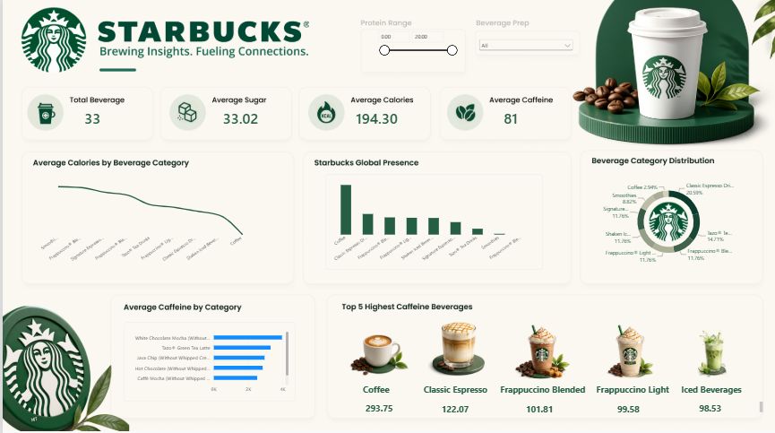

# Starbucks Beverage Analysis Dashboard

## 📊 Project Overview

This project is an interactive Starbucks Beverage Analysis Dashboard created using Microsoft Power BI.

The dashboard explores different Starbucks beverages and provides insights into caffeine, calories, beverage categories, and Starbucks' global presence.

## 🛠️ Tools Used

- Microsoft Power BI
- Power Query
- DAX
- GitHub

## 📈 Dashboard Features

The dashboard includes:

- Average Calories
- Average Caffeine
- Starbucks Global Presence
- Beverage Category Distribution
- Top 5 Highest Caffeine Beverages
- Beverage-level caffeine analysis

## 🔍 Key Insights

The dashboard helps identify:

- Which beverage categories are most common in the dataset
- Which beverages contain the highest amounts of caffeine
- Average caffeine and calorie levels across beverages
- The distribution of Starbucks beverage categories

## 📷 Dashboard Preview

## 📁 Project Files

- Starbucks_Beverage_Analysis.pbix — Power BI dashboard file
- dashboard.png — Dashboard preview image

## 👤 Author

Created as a Power BI data visualization project.
